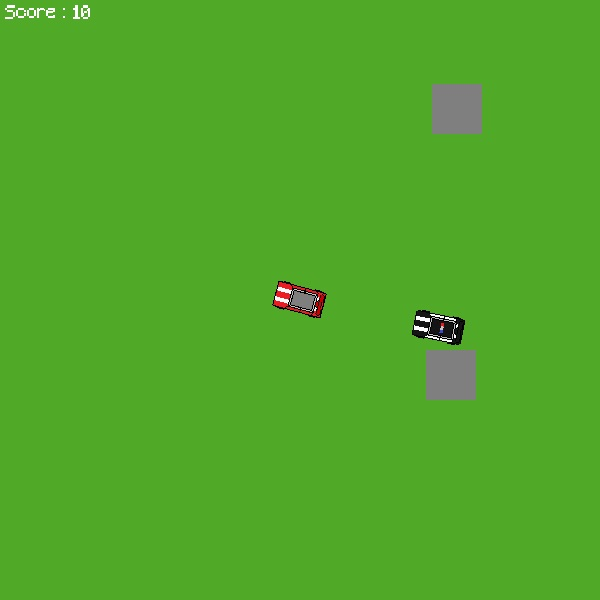

# Python-Car-Escape-Game

A game in which you have to drive and dodge police cars.
## Features
- The game
## Installation
1. Download the repository by clicking on `Code > Download ZIP`
2. Extract the ZIP file
3. Run `main.pyw`
## Requirements
- Python 3.7
- Python pygame library
- Python math library
- Python random library
- Python sys library
- Python time library
## Usage
The car moves by itself and you can only turn it using `LEFT` and `RIGHT` arrow keys.